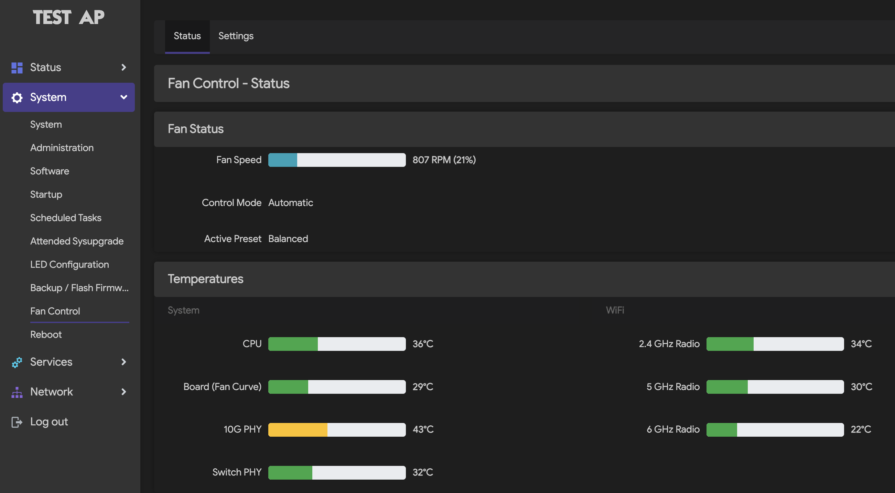
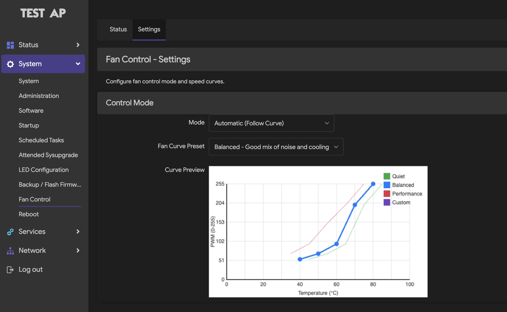

# luci-app-w1700k-fancontrol

LuCI application for fan control and thermal monitoring on W1700K router (Airoha AN7581 + MT7996 BE19000).

## Features

- **Real-time Temperature Monitoring**
  - CPU temperature (AN7581 SoC die)
  - Board temperature (NCT7802Y local sensor - used for fan curve)
  - 10G PHY temperature
  - Switch PHY temperature
  - WiFi radio temperatures (2.4 GHz, 5 GHz, 6 GHz from MT7996)

- **Fan Speed Control**
  - Real-time RPM and PWM display
  - Automatic mode with configurable fan curves
  - Manual mode with fixed PWM control
  - Visual temperature gauges with color-coded status

- **Fan Curve Presets**
  - **Quiet** - Lower fan speeds, allows higher temperatures
  - **Balanced** - Good mix of noise and cooling (default)
  - **Performance** - Aggressive cooling, higher fan speeds
  - **Custom** - User-definable 5-point temperature curve

- **Interactive Curve Editor**
  - Visual graph showing all preset curves
  - Real-time curve preview when switching presets
  - 5-point temperature-to-PWM mapping

## Hardware Architecture

```
+-------------------------------------------------------------------+
|                           W1700K Router                            |
|                                                                    |
|  +----------------+    +------------------+    +--------------+    |
|  |   AN7581 SoC   |    |   NCT7802Y Fan   |    |   MT7996     |    |
|  |                |    |   Controller     |    |   WiFi 7     |    |
|  |   CPU temp     |    |                  |    |              |    |
|  |   (thermal     |    |   Board temp     |    |   2.4G temp  |    |
|  |    zone0)      |    |   (temp1_input)  |    |   5G temp    |    |
|  |                |    |                  |    |   6G temp    |    |
|  +----------------+    |   Fan control:   |    +--------------+    |
|                        |   - PWM output   |                        |
|  +----------------+    |   - RPM input    |                        |
|  |  PHY Sensors   |    |   - Auto curve   |                        |
|  |                |    +------------------+                        |
|  |  10G PHY temp  |             |                                  |
|  |  Switch temp   |      +------+------+                           |
|  +----------------+      |             |                           |
|                          |    FAN      |                           |
|                          |   (PWM)     |                           |
|                          +-------------+                           |
+-------------------------------------------------------------------+
```

## Screenshots

The app adds two pages under **System > Fan Control** in LuCI:

### Status Page

Real-time monitoring of fan speed and all temperature sensors with color-coded gauges.



### Settings Page

Configure fan control mode and customize fan curves with visual preview.



## Installation

### From OpenWrt Feeds

Add this package to your OpenWrt build:

```bash
# Copy to feeds/luci/applications/
cp -r luci-app-w1700k-fancontrol feeds/luci/applications/

# Update and install
./scripts/feeds update luci
./scripts/feeds install luci-app-w1700k-fancontrol

# Enable in menuconfig
make menuconfig
# Navigate to: LuCI -> Applications -> luci-app-w1700k-fancontrol

# Build
make package/feeds/luci/luci-app-w1700k-fancontrol/compile
```

### Manual Installation

Copy files directly to your router:

```bash
# Create directories
mkdir -p /usr/share/luci/menu.d
mkdir -p /usr/share/rpcd/acl.d
mkdir -p /usr/libexec/rpcd
mkdir -p /www/luci-static/resources/view/fan
mkdir -p /etc/init.d
mkdir -p /etc/config

# Copy files
cp root/usr/share/luci/menu.d/luci-app-w1700k-fancontrol.json /usr/share/luci/menu.d/
cp root/usr/share/rpcd/acl.d/luci-app-w1700k-fancontrol.json /usr/share/rpcd/acl.d/
cp root/usr/libexec/rpcd/luci.fan /usr/libexec/rpcd/
cp htdocs/luci-static/resources/view/fan/status.js /www/luci-static/resources/view/fan/
cp htdocs/luci-static/resources/view/fan/settings.js /www/luci-static/resources/view/fan/
cp root/etc/init.d/fan /etc/init.d/
cp root/etc/config/fan /etc/config/

# Set permissions
chmod +x /usr/libexec/rpcd/luci.fan
chmod +x /etc/init.d/fan

# Enable and start service
/etc/init.d/fan enable
/etc/init.d/fan start
/etc/init.d/rpcd restart
```

## Requirements

- OpenWrt with LuCI
- Airoha AN7581 target (`@TARGET_airoha`)
- NCT7802Y fan controller (hwmon5)
- MT7996 WiFi (for radio temperature monitoring)

## Files

```
luci-app-w1700k-fancontrol/
├── Makefile                                          # OpenWrt package makefile
├── LICENSE                                           # Apache 2.0 license
├── README.md                                         # This file
├── screenshots/
│   ├── fan_status.png                                # Status page screenshot
│   └── fan_setting.png                               # Settings page screenshot
├── htdocs/
│   └── luci-static/resources/view/fan/
│       ├── status.js                                 # Status page with gauges
│       └── settings.js                               # Settings page with curve editor
└── root/
    ├── etc/
    │   ├── config/
    │   │   └── fan                                   # UCI configuration with presets
    │   └── init.d/
    │       └── fan                                   # Init script for applying settings
    └── usr/
        ├── libexec/rpcd/
        │   └── luci.fan                              # RPC backend script
        └── share/
            ├── luci/menu.d/
            │   └── luci-app-w1700k-fancontrol.json   # Menu configuration
            └── rpcd/acl.d/
                └── luci-app-w1700k-fancontrol.json   # ACL permissions
```

## Configuration

The app uses UCI configuration at `/etc/config/fan`:

```
config fancontrol 'settings'
    option mode 'auto'              # 'auto' or 'manual'
    option manual_pwm '127'         # PWM value for manual mode (0-255)
    option curve_preset 'balanced'  # 'quiet', 'balanced', 'performance', 'custom'

config curve 'quiet'
    option point1_temp '45'
    option point1_pwm '54'
    # ... (5 points total)

config curve 'balanced'
    # ... default preset

config curve 'performance'
    # ... aggressive cooling

config curve 'custom'
    # ... user-editable curve
```

## Data Sources

| Sensor | Source | Description |
|--------|--------|-------------|
| CPU | `/sys/class/thermal/thermal_zone0/temp` | AN7581 SoC die temperature |
| Board | `/sys/class/hwmon/hwmon5/temp1_input` | NCT7802Y local sensor (fan curve input) |
| 10G PHY | `/sys/class/hwmon/hwmon0/temp1_input` | 10 Gigabit Ethernet PHY |
| Switch PHY | `/sys/class/hwmon/hwmon1/temp1_input` | Gigabit switch PHY |
| WiFi 2.4G | `/sys/class/hwmon/hwmon2/temp1_input` | MT7996 2.4 GHz radio |
| WiFi 5G | `/sys/class/hwmon/hwmon3/temp1_input` | MT7996 5 GHz radio |
| WiFi 6G | `/sys/class/hwmon/hwmon4/temp1_input` | MT7996 6 GHz radio |
| Fan RPM | `/sys/class/hwmon/hwmon5/fan1_input` | NCT7802Y tachometer input |
| Fan PWM | `/sys/class/hwmon/hwmon5/pwm1` | NCT7802Y PWM output (0-255) |

## Fan Curve Details

The NCT7802Y supports hardware-based automatic fan control with a 5-point temperature curve. PWM values were reverse-engineered from stock firmware:

| RPM | PWM |
|-----|-----|
| 770 | 54 |
| 1000 | 69 |
| 1400 | 95 |
| 2700 | 199 |
| Max | 255 |

## License

Apache-2.0

## Author

Created for W1700K router (Airoha AN7581 + MT7996 BE19000)
